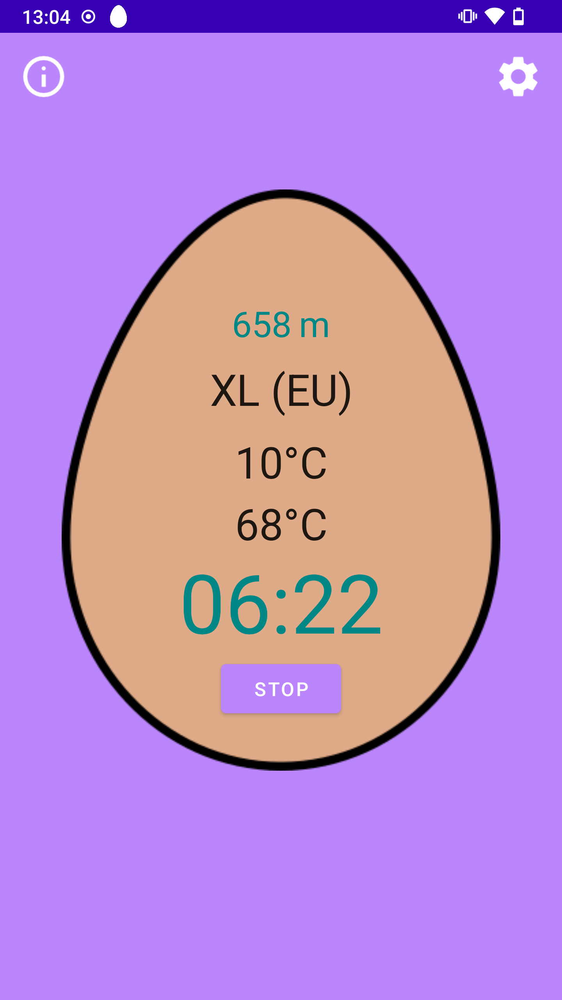

# Smart EggTimer

 
This application provides an egg timer which calculates the boiling time according to the formula derived by Dr. Charles D. H. Williams,
based on required consistency, altitude, start temperature, and egg weight.

The formula is taken from here: https://khymos.org/2009/04/09/towards-the-perfect-soft-boiled-egg/

## Used third-party libraries

- AndroidX libraries (https://github.com/androidx/androidx) which is licensed under <a href='https://github.com/androidx/androidx/blob/androidx-main/LICENSE.txt'>Apache License Version 2.0</a>
- 
